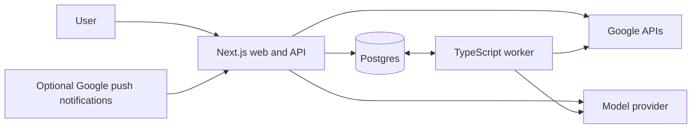

# Google Workspace assistant: MVP and SaaS scope

Prepared 2 October 2026. The first release is an invite-only beta for people with several Google accounts. The next release is a public SaaS.

## Product decision

Build a TypeScript app that connects a person's existing Google accounts and gives them one inbox, calendar, task view, and assistant. Google remains the source of truth. Users can keep using Gmail, Calendar, and Tasks alongside the app.

The first product promise is concrete: a person with 12 Gmail accounts and eight calendars can read and reply from the correct account, find availability across their selected calendars, and turn email into tasks without maintaining forwarding rules.

The complete product can cover files, documents, spreadsheets, presentations, meetings, and chat. Shipping every Workspace application's full interface in the MVP would add months. The beta therefore delivers Gmail, Calendar, and Tasks thoroughly, with contact lookup. File and document workflows follow as a separate expansion.

Start with five to eight beta testers and track the total number of Google accounts they authorize. The test quota applies to Google accounts, so someone connecting 12 accounts consumes considerably more capacity than a single-account tester.

## What to take from Postiz

Use Postiz as a reference for connecting accounts, showing their status, drafting content, scheduling approved actions, retrying work, and displaying an activity history. Its current architecture uses a frontend, backend, orchestrator, Postgres, Redis, and Temporal. That is useful evidence of the need for durable background work, but adopting the whole application introduces a substantial amount of social publishing code. [Postiz architecture](https://github.com/gitroomhq/postiz-docs/blob/main/self-host/architecture.mdx).

Recommendation: start a small application and implement these patterns around Google resources. Do a short repository review at the start of development to identify any components worth reusing, rather than committing to a fork.

Postiz is AGPL-3.0. Its license includes source availability obligations for modified versions offered over a network. Decide whether the product will accept those obligations before copying covered code. A separate implementation based on general workflow ideas avoids making a fork the default. [Postiz license](https://github.com/gitroomhq/postiz-app/blob/main/LICENSE).

## Beta features and boundaries

| Area | Included in the beta | Deferred |
| --- | --- | --- |
| Accounts | Multiple consumer Gmail and Workspace accounts, account labels, permissions, reconnect, disconnect, per-account defaults | Microsoft accounts, administrative impersonation, shared credential management |
| Gmail | Unified inbox, full threads, search, labels, read state, archive, trash and restore, drafts, compose, reply, reply-all, forward, attachments, scheduled sends | Permanent deletion, forwarding setup, delegation management, bulk campaigns, advanced mailbox settings |
| Calendar | Combined agenda/week view, calendar selection, availability, standard events, invites, RSVP, recurrence, rescheduling, cancellation, Meet links | Calendar ACL management, resource administration, appointment booking pages, specialized event editing |
| Tasks | Task lists, tasks, notes, due dates, completion, deletion, subtasks, ordering, task creation from email | Native recurring-task editing, native task due times, a full project management system |
| Contacts | Opt-in contact lookup and recipient suggestions within selected accounts | Contact merging, directory administration, contact writes |
| Assistant | Grounded answers, thread summaries, reply drafts, meeting proposals, task extraction, approved multi-step actions | General browser automation, arbitrary scripts, unrestricted autonomous sending |
| Automation | Scheduled brief, follow-up reminders, approved send scheduling, suggestions for inbox triage | A visual workflow builder, extensive third-party integrations |
| SaaS foundation | User isolation, account permissions, action history, invite access, usage measurement, deletion | Payment collection, organization collaboration, enterprise SSO |

### Accounts and onboarding

- App sign-in creates one user identity and one owned workspace. Connecting another Google account does not create another app user or switch the current session.
- Connect each account through its own OAuth consent flow. Identify it using Google's stable subject identifier, and show its verified email to the user.
- Let users label accounts and group them as personal, company, client, or another chosen group.
- Choose which calendars count toward availability and which account, calendar, and task list receive new items.
- Let users select which accounts the assistant may read. Cross-account questions can use several selected accounts; outgoing content only uses the context approved for that action.
- Show per-account sync state, last successful sync, granted features, denied permissions, and reconnect status. A failing account must not block the other accounts.
- Handle partial consent and Workspace administrator restrictions with a useful explanation. Never treat an inaccessible calendar as empty.
- Disconnect revokes access where appropriate, cancels pending actions for that connection, and removes its cached data under the documented retention policy.

### Gmail

- Show inbox, unread, starred, sent, drafts, and custom-label views. Preserve the account badge on every row and inside every thread.
- Support search across selected mailboxes with sender, recipient, subject, date, labels, and Gmail query syntax. Search older mail through Google on demand, even if it is outside the local cache.
- Hydrate the entire thread when it is opened or used to compose a reply. A recent-mail cache must not truncate the context needed for a correct reply.
- Preserve plain text, sanitized HTML, MIME structure, inline images, attachment metadata, recipients, dates, and relevant headers. Block remote image loading by default.
- Compose mail with To, Cc, Bcc, subject, body, signatures, and attachments. Allow approved existing send-as identities, with the actual sending account visible.
- Support reply, reply-all, and forward as different operations. Respect Reply-To, remove the user's own known identities from reply-all, and never invent recipients or expose hidden recipients.
- Create and update real Gmail drafts. A draft edited in Gmail must appear in the app. Resolve concurrent edits with a preview rather than overwriting silently.
- Save an attachment-bearing draft to Gmail before scheduling it. This keeps durable attachment storage in Gmail for the first release. Set a conservative app upload limit, initially 10 MiB in total per message, and show the limit before upload.
- Read, unread, star, archive, label, move to trash, and restore individual messages or threads, using the correct operation granularity.
- Schedule an approved draft for a specified time and timezone. Show queued, sent, canceled, paused, and failed states. Editing its approved content invalidates the prior approval.
- Keep follow-up reminders in the app. They do not automatically send another email.

Replies require the mailbox's `threadId`, correct `In-Reply-To` and `References` headers, and matching subject handling. Thread identifiers always stay attached to the originating connection. [Google threading requirements](https://developers.google.com/workspace/gmail/api/guides/threads).

Track the Gmail draft's stable container ID separately from its message ID, which changes on replacement. Sending removes the draft and creates a new sent message. Reconcile that transition instead of treating a missing draft as a failed send. [Gmail draft lifecycle](https://developers.google.com/workspace/gmail/api/guides/drafts).

Existing send-as identities can be listed with the Gmail scopes already needed for this product. Creating or administering aliases is a different feature and stays outside the MVP. [Send-as listing](https://developers.google.com/workspace/gmail/api/reference/rest/v1/users.settings.sendAs/list).

### Calendar and meetings

- Discover the calendars available through every connection and respect each calendar's access role.
- Provide an agenda and week view with calendar/account filters. Resolve the `primary` alias to the actual calendar identifier.
- Avoid showing the same shared calendar twice when two connected identities access it. Keep each connection's access rights separate.
- Combine busy intervals across all calendars selected for availability. Apply working hours, buffers, timezone, and meeting duration as deterministic rules.
- Check live free/busy information before proposing a final booking, and check again just before creating it. External changes can still race with a booking, so show conflicts rather than claiming a global lock.
- Create, read, update, reschedule, and cancel standard events. Include location, description, attendees, reminders, and Google Meet conference data where supported.
- Read and respond to invitations. Distinguish the organizer's permissions from an attendee's permissions, and show whether an operation sends attendee notifications.
- Support all-day events, daylight saving transitions, recurring series, and occurrence exceptions. The beta supports editing one occurrence or the entire series. Editing this and all following occurrences is deferred.
- Preserve existing conference data on event updates. Meeting links must belong to the correct calendar and organizer identity.
- Do not copy personal event titles into a work invitation or another calendar merely to check availability. Optional private busy-block mirroring is a later feature.

Google supports creating Meet conference data through Calendar. Creation may be asynchronous and calendars differ in supported conference types. [Calendar event creation](https://developers.google.com/workspace/calendar/api/guides/create-events). Free/busy calls provide busy intervals rather than event descriptions. [Free/busy API](https://developers.google.com/workspace/calendar/api/v3/reference/freebusy/query).

### Tasks and contacts

- List and manage the task lists belonging to each connected account.
- Create, read, update, complete, reopen, delete, order, and nest standard tasks where supported by the API.
- Store email/event provenance in the app and include a useful source URL in task notes when possible. Do not claim to create Google's read-only native task-link metadata.
- Extract proposed tasks from mail. Show the target account, list, title, notes, and due date before applying changes.
- Add optional app reminders with a specific timestamp. These are separate from the task's Google due date.
- Show assigned tasks as their own category and preserve their source. Restrict writes when Google's assigned-task rules do not permit the requested operation.
- Use opt-in People API contact lookup for recipient suggestions. Keep suggestions scoped to selected accounts and request a choice when a name matches several people. [People connections API](https://developers.google.com/people/api/rest/v1/people.connections/list).

The Tasks API exposes due dates without a writable due time. It also imposes special restrictions on assigned tasks. Native recurring-task rules are not part of the exposed task resource. The app must distinguish its reminders from native Tasks behavior. [Tasks resource](https://developers.google.com/tasks/reference/rest/v1/tasks).

### Assistant and automation

One assistant coordinates a bounded set of typed tools. It retrieves facts, produces a proposed action, and calls the same application services used by the UI. It cannot choose credentials directly or execute arbitrary code.

Initial workflows:

1. Summarize unread mail across selected accounts, with links to the source threads.
2. Draft a reply in the originating mailbox using the selected thread and that account's writing preferences.
3. Find meeting options across selected calendars and draft the corresponding reply. Booking and sending have separately visible results.
4. Turn an email into a task in a selected account and list.
5. Prepare a daily brief containing meetings, due tasks, mail needing a reply, and synchronization gaps.
6. Remind the user about a sent thread that has not received a reply, with controls to stop the reminder.
7. Suggest an inbox action, such as applying a label or archiving a set of messages, with a bounded preview.

Reads and requested draft preparation can run automatically. Sends, invitations, cancellations, deletions, and other external changes require approval in the beta. A direct UI send or save is itself the approval; users should not receive another redundant prompt.

Persist an approval against exact recipients, identity, resource, content hash, and timing. Check it again in the worker. A changed draft, changed action, new reply affecting a scheduled response, or changed target requires a fresh preview or pauses the action.

Treat emails, attachments, and documents as data. Their text cannot grant permissions, expand account scope, or instruct the app to send data elsewhere. Limit tool steps, model tokens, time, and account fan-out for each run.

The TypeScript AI SDK supports schema-defined tools and approval flows. The application still owns durable action state and authorization, so approval survives a browser or process restart. [AI SDK tools](https://ai-sdk.dev/docs/ai-sdk-core/tools-and-tool-calling).

### Minimum interface

| View | What a user can do |
| --- | --- |
| Today | Read the daily brief, meetings, tasks, and items waiting for attention |
| Inbox | Filter/search across accounts and open real threads |
| Thread and composer | Read mail, manage drafts, choose reply mode, send or schedule |
| Calendar | See the combined agenda, find slots, manage events and invitations |
| Tasks | Select account/list, manage tasks, inspect linked sources |
| Assistant | Ask questions, inspect sources, review proposed actions |
| Approvals and activity | Approve/reject, cancel schedules, inspect completed and failed steps |
| Connections and settings | Connect accounts, select scope/defaults, reconnect, export/delete app data |

Use standard responsive components and familiar inbox/calendar layouts. Build a web app first. Mobile access uses the responsive site; native mobile clients are deferred.

## TypeScript architecture

| Layer | Choice | Reason |
| --- | --- | --- |
| Repository | pnpm workspace | Share domain services between web and worker |
| Runtime | A supported Node.js LTS, pinned in source and Railway | Predictable builds and one runtime throughout |
| Web and API | Next.js with React | UI, API routes, OAuth callbacks, and streaming assistant responses in one service |
| App authentication | Better Auth with a Postgres adapter | Existing Google sign-in/session implementation; separate app login from resource connections |
| Data | Railway Postgres with Prisma migrations | Cache, permissions, actions, and operational state in one database |
| Jobs | pg-boss using the same Postgres | Durable schedules, retries, and workers without another database service |
| Google integration | Official `googleapis` and `google-auth-library`, behind small typed adapters | Explicit account selection and access to provider-specific behavior |
| AI | AI SDK, Zod tool schemas, one configured model provider | Typed tool execution with bounded requests |
| Search | Google queries plus Postgres search over cached data | Avoid a separate search cluster or vector store initially |
| Verification | TypeScript checks, Vitest integration tests, browser workflow tests | Verify account routing, synchronization, and external side effects |

Better Auth supplies app sign-in. Workspace OAuth connection routes should maintain their own connection records and credential handling. [Google sign-in documentation](https://better-auth.com/docs/authentication/google).

pg-boss runs on Postgres and supports delayed work, schedules, retry policies, and concurrent workers. Its queue guarantees do not make a Gmail send and a local transaction atomic. [pg-boss documentation](https://github.com/timgit/pg-boss).



Repository outline:

```text
apps/web       UI, HTTP API, app sessions, OAuth callbacks
apps/worker    sync, scheduled actions, reminders, daily briefs
packages/core  permissions, Google adapters, actions, agent tools
packages/db    Prisma schema, migrations, job integration
```

The modules need distinct responsibilities, but they remain one codebase. Start with no separate API service, Redis, Temporal cluster, vector database, or general-purpose agent network.

### Data model and authorization

| Record | Important fields or relationships |
| --- | --- |
| User, workspace, membership | App identity, owned workspace, owner/member role |
| Google connection | Workspace, Google subject, email, encrypted credentials, granted scopes, status |
| Account preferences | Label, context group, writing preferences, allowed assistant operations |
| Calendar and calendar access | Actual calendar identity; connection-specific access rights and availability selection |
| Mail thread and message | Connection ID plus provider IDs; headers, labels, bodies/cache timestamps |
| Gmail draft | Connection, stable draft ID, current message ID, content version/hash |
| Event | Calendar identity, provider ID, recurrence identity, original start, provider version |
| Task list and task | Connection plus provider IDs, parent/position, due date, source provenance |
| Sync state | Per connection/resource cursor, pages, retry state, last success |
| Agent run | User, selected accounts, source references, steps, cost and outcome |
| Action and approval | Exact validated payload, content hash, approver, state, external result IDs |
| Automation | Enabled template, account filters, schedule, timezone, last run |
| Audit and usage | Actor, affected account/resource, result, AI tokens, operation counts |

Every request and job resolves workspace and permissions from trusted server state. Scope all queries to that workspace, and validate resource ownership before retrieving credentials. Do not trust a workspace or connection ID supplied by the model.

Use composite keys and database constraints so a provider ID from one account cannot resolve to another account's record. Email copies in different mailboxes remain separate resources. The UI may group related copies, but operations still target explicit mailbox resources.

Encrypt refresh tokens at the application layer with authenticated encryption and key versioning. Store encryption keys in Railway secrets, separate from the database. Redact credentials, message bodies, and recipients from routine operational logs. Bound database connections for both processes.

### Synchronization

Start with polling so beta deployment only requires OAuth and Google APIs. Target a one to two minute interval for actively used accounts and a slower interval for idle accounts, with jitter and quota backoff. This is a product target to validate against actual quotas and workload, not a guaranteed provider latency.

- Gmail: cache recent metadata, inbox/sent activity, labels, and drafts; fetch bodies/attachments as needed. Older inbox entries remain accessible through provider-backed pagination, so the cache window does not hide outstanding mail. Use `history.list` for changes. Advance the cursor only after successfully applying every page. Recover from expired history with a new bounded initial sync. [Gmail sync](https://developers.google.com/workspace/gmail/api/guides/sync).
- Calendar: maintain provider sync state per calendar and preserve tombstones. Apply incremental pages and reset the affected cache when Google returns `410`. Use valid query parameters for sync tokens; do not combine them with incompatible moving-window filters. Hydrate date-range views and recurrence details as needed. [Calendar sync](https://developers.google.com/workspace/calendar/api/guides/sync).
- Tasks: poll task lists and changed tasks using the supported list filters, with periodic reconciliation for deletions and list changes. Do not assume Gmail-style history or Calendar-style tokens.
- After a write: update the UI with the returned provider result, then reconcile through the normal sync path.
- Backfill: begin with a recent-mail window, initially 30 days, and display that limit. Older search and thread retrieval query Google on demand.

Once the beta is stable, add Gmail Pub/Sub push and Calendar notifications to reduce delay. Keep periodic reconciliation. Gmail watches need renewal, and notifications can be delayed or dropped. Adding push introduces a Google Cloud Pub/Sub resource even though the app runs on Railway. [Gmail push](https://developers.google.com/workspace/gmail/api/guides/push).

### Durable action handling

Actions move through proposed, approved, queued, running, succeeded, failed, canceled, or needs-review states. Each step in a multi-step workflow has its own outcome.

Use a database transaction/outbox to persist an approved action and its queued work together. Claim actions with a lease and serialize conflicting operations on the same resource. Repeatable local requests use the same idempotency key.

Before sending, fetch the current Gmail draft and check its account, recipients, content hash, approval, and cancellation state. An unrelated or edited draft must never inherit approval. Pass that validated MIME content explicitly to the send operation, so a concurrent draft edit cannot substitute unapproved recipients or text between the check and the send. Gmail permits updating the content in a draft-send request. [Draft send payload](https://developers.google.com/workspace/gmail/api/guides/drafts). Before booking, recheck permissions and availability.

Safe reads can retry with backoff. Writes need operation-specific handling. For a Gmail send timeout, Google may have accepted the message even though the app received no confirmation. Try to reconcile the draft and sent mailbox using stored provider IDs and message headers. If the result remains uncertain, pause for review. Do not blindly send again or promise exactly-once email delivery.

For event creation, use provider-supported client identifiers where applicable and reconcile after uncertainty. Preserve provider versions for update conflict checks. For any operation lacking a reliable deduplication mechanism, prefer needs-review over a possibly duplicated external change.

Canceling a queued action prevents execution. An action already accepted by Google cannot necessarily be recalled. The UI must report the actual state.

## OAuth and public-launch work

Google Cloud is needed for the OAuth client and enabled APIs. Railway hosts the application; it does not replace Google's authorization process.

| Capability | Initial scope approach |
| --- | --- |
| App login | `openid`, `email`, `profile` |
| Gmail core | `https://www.googleapis.com/auth/gmail.modify` |
| Calendar events | `https://www.googleapis.com/auth/calendar.events` |
| Calendar discovery | `https://www.googleapis.com/auth/calendar.calendarlist.readonly` |
| Availability | `https://www.googleapis.com/auth/calendar.events.freebusy` |
| Tasks | `https://www.googleapis.com/auth/tasks` |
| Optional contact lookup | `https://www.googleapis.com/auth/contacts.readonly` |
| File expansion | Begin with `https://www.googleapis.com/auth/drive.file` and Google Picker |

Verify the final scope set against every selected API method during implementation. Request optional capabilities when the user enables them, rather than asking for every Workspace scope at initial sign-in. Gmail modify covers the beta's core mail operations without requesting the full permanent-delete scope. [Gmail scopes](https://developers.google.com/workspace/gmail/api/auth/scopes). Separate Calendar scopes cover events, discovery, and availability. [Calendar scopes](https://developers.google.com/workspace/calendar/api/auth).

In external Testing mode, Google allows up to 100 listed test accounts and Workspace authorization expires after seven days. Make reconnect part of beta onboarding and explain this before testers rely on unattended schedules. This is a test-mode limitation, not the intended permanent experience. [Google app audience](https://support.google.com/cloud/answer/15549945), [OAuth refresh-token behavior](https://developers.google.com/identity/protocols/oauth2).

Public SaaS launch has a separate critical path: verified domains, published app identity, privacy policy and terms, least-privilege scope justification, a demonstration of each scope, reviewer access, restricted-scope verification, and any required security assessment. Broad Gmail access is restricted; server-side handling brings assessment requirements unless an applicable exemption applies. An invite-only commercial beta is not automatically a permanent exemption. Personal-use and internal-organization exemptions have narrower conditions. [Restricted-scope verification](https://developers.google.com/identity/protocols/oauth2/production-readiness/restricted-scope-verification), [Verification exemptions](https://support.google.com/cloud/answer/13464323).

Disclose model processing, minimize the content sent to the model, use suitable provider retention/training controls, and provide deletion. Workspace data cannot be used to train a general model beyond the policy's allowed user-specific purposes. Confirm the chosen provider contract and configuration before live data enters it. [Workspace user data policy](https://developers.google.com/workspace/workspace-api-user-data-developer-policy).

For launch, choose and implement a documented cache and audit retention policy. A proposed beta default is a 30-day mail cache, shorter-lived attachment handling, and 90-day redacted action metadata. Deleting app data does not delete the user's Gmail or Calendar data. Include backup retention and deletion expiry in the policy.

## Railway deployment plan

Deploy one project with the following resources. Staging and production must use isolated databases, secrets, and Google OAuth projects.

| Resource | Deployment configuration |
| --- | --- |
| Web | Next.js service, public HTTPS domain, OAuth callbacks, `/api/health` |
| Worker | Same repository, compiled TypeScript worker start command, always running, no public domain |
| Postgres | Shared by web and worker within the environment over private networking; persistent storage and configured backups |
| Bucket | Add when durable app-owned file uploads or exports are introduced; Gmail drafts hold beta mail attachments |

Implementation sequence:

1. Pin Node and pnpm, commit the lockfile, and provide deterministic web/worker build and start scripts.
2. Keep repository-root build context so each service can access shared packages. Give web and worker their own build/start commands and watch paths. [Railway shared monorepos](https://docs.railway.com/deployments/monorepo).
3. Provision Postgres and set both services' `DATABASE_URL` from Railway's private connection reference.
4. Add app URL, app session secret, Google OAuth client ID/secret, callback URLs, token encryption key/version, model key/model identifier, beta access controls, and usage limits as service variables. Keep credentials out of client-public environment variables.
5. Set Next.js standalone output and verify the start script includes its generated server and static assets. Bind the web server to Railway's assigned port and a reachable interface.
6. Run `prisma migrate deploy` as a controlled pre-deploy step. Initialize job-queue schema deliberately and use backward-compatible migrations so an old worker can coexist briefly with a new web deployment.
7. Configure the HTTPS domain and exact Google callback URLs. Use separate callbacks or explicit connection state for app login and linking additional accounts.
8. Keep the worker awake for polling and schedules. Add restart policy, graceful shutdown, bounded leases, a database heartbeat, and a stale-heartbeat alert. Web health alone does not prove the worker is healthy.
9. Configure database backups, then perform a restore rehearsal. Redact logs and report sync delay, queue age, failed jobs, token failures, and usage costs.
10. Verify each deployment reaches success, then perform a smoke workflow with two accounts and a worker restart before inviting testers.

Railway documents a Next.js/web plus background-worker deployment pattern, production migrations, health checks, and environment isolation. This plan uses pg-boss in place of the guide's Redis queue. [Railway full-stack guide](https://docs.railway.com/guides/fullstack-nextjs). Service communication stays private. [Private networking](https://docs.railway.com/networking/private-networking).

## Build order and estimates

Estimates below are engineering planning ranges for an experienced full-time TypeScript engineer. They include integration and reliability work. Google review/assessment elapsed time is separate and can overlap development.

| Milestone | Deliverable | Estimate |
| --- | --- | --- |
| 0. Validate the difficult path | Two Google accounts, correct-thread reply draft/send, live cross-account availability, Tasks create, deployed worker restart; inspect Postiz for reusable patterns | 3 to 5 working days |
| 1. Foundation | App login, tenant model, multi-account OAuth, encrypted tokens, permissions, invite access, Railway staging | 4 to 6 days |
| 2. Mail | Incremental sync, unified inbox/search, full threads, MIME handling, drafts, replies, forwards, attachments, send states | 8 to 12 days |
| 3. Calendar | Unified view, availability, event actions, RSVP, recurrence, timezone handling, Meet support | 6 to 9 days |
| 4. Tasks and contacts | Lists/tasks, provenance, reminders, opt-in contact lookup | 3 to 5 days |
| 5. Assistant and schedules | Typed tools, previews/approvals, worker execution, scheduled send, briefs, follow-up reminders | 6 to 9 days |
| 6. Beta readiness | Cross-account tests, recovery/ambiguity handling, retention/deletion, backup restore, monitoring, onboarding | 6 to 9 days |

Total beta estimate: 36 to 55 working days, approximately 8 to 11 calendar weeks for one engineer. With two engineers and clear ownership, budget roughly 5 to 8 weeks. Avoid assuming work halves exactly because OAuth, shared services, and end-to-end validation have dependencies.

Milestone 0 is the feasibility gate. A working demonstration can exist in about a week. That is a narrower slice than the finished beta.

Start OAuth scope justification, privacy documentation, and assessor discovery during the foundation milestone. Do not wait until the beta ends to begin the public-launch process.

## Beta acceptance criteria

The release is complete when these workflows pass against real test accounts and targeted failure tests:

1. One user connects 12 Google accounts and sees at least eight selected calendars. Mixed consumer and Workspace accounts work when their administrators permit access.
2. A second user cannot access the first user's cached mail, credentials, agent sources, attachments, or actions, even when supplying known record IDs.
3. Inbox/search results always show their account. An older search result can open the full thread despite the initial cache window.
4. Reply and reply-all use the correct account, identity, recipients, and Gmail conversation. Tests cover Reply-To, self-alias removal, attachments, HTML/plain text, and similar-subject threads in different mailboxes.
5. A draft created or edited in Gmail reconciles correctly. A queued send cannot silently use changed recipients or content.
6. Availability checks include every selected accessible calendar. Failed or disconnected calendars produce an incomplete-availability result, not a false free slot.
7. All-day, timezone, DST, recurring-instance, and recurring-series workflows preserve the intended dates and attendee notifications.
8. An email-derived task appears in the selected Google account/list, with a source link and a date-only due field. An app reminder retains its separate timestamp.
9. A scheduled action survives a worker restart. Concurrent workers cannot execute the same approved action without passing its claim and reconciliation checks.
10. A simulated ambiguous email-send timeout pauses or reconciles; it does not blindly retry. Partial multi-step failures report exactly which steps succeeded.
11. Expired/revoked credentials pause the affected work and offer reconnect. Expired Gmail/Calendar sync cursors rebuild only the affected cache without losing pending approvals.
12. A malicious email asking the assistant to forward other accounts' mail cannot expand permissions or bypass approval.
13. Disconnect/delete cancels pending work and removes live app data according to policy. Backups expire under the documented retention schedule.
14. Testers can complete read/reply, find a meeting slot, and create a task without developer intervention. Queue/sync health and per-workflow model costs are visible to operators.

Test the services with recorded provider fixtures and targeted fault injection, then smoke-test the important flows against owned Google test accounts. Include meaningful browser checks for account switching, approvals, and the composer. Do not substitute UI screenshots for thread and provider-state verification.

## Expansion to broader Google Workspace

| Application | First expansion | Later depth and boundaries |
| --- | --- | --- |
| Drive | User-selected file access, open/search among authorized files, summaries, email attachment saving, file linking | Wider Drive search/sync, shared drives, folders, moves/copies, sharing and permission changes |
| Docs | Read/summarize selected documents, create meeting briefs, fill templates, propose text edits | Larger document edits, formatting, comments where supported, revision-aware workflows |
| Sheets | Read ranges, append structured rows, update approved cells, produce small tracking sheets | Formula edits, larger batch operations, schema mapping, exports |
| Slides | Read selected presentations, generate a deck from an approved template | Template-aware edits, styling, image placement, rendering/verification |
| Meet | Calendar-created meeting links in the beta; later retrieve available meeting artifacts and create follow-up drafts/tasks | Artifact availability depends on the meeting, account entitlements, and permissions; do not promise a transcript for every meeting |
| Chat | Read permitted spaces/threads and draft/send approved replies under the user's identity | Separate chat authorization and notification setup; bot access is not a substitute for all user-visible messages |
| Forms | Create/update forms and read responses for user-owned workflows | Response-triggered tasks and Sheets updates; do not assume arbitrary response submission is an API capability |
| Contacts | Lookup in beta; later approved create/update | Deduplication, merging, directory integration, and ownership policy |
| Keep | Evaluate as an enterprise-specific integration | Google's published API is oriented to enterprise administration and domain-wide authorization; do not promise ordinary consumer-account coverage |
| Admin, Groups, Sites, Vault, Apps Script, other Workspace products | Separate requirements and API feasibility review | These are distinct products with admin roles or product-specific limitations, not part of the personal-assistant MVP |

Begin the file phase with Google Picker and `drive.file`, which provides access to files users choose or the app creates. Whole-Drive search requires a broader access decision; it is not covered by per-file permission alone. [Drive scopes](https://developers.google.com/workspace/drive/api/guides/api-specific-auth).

Document, spreadsheet, and presentation editing can use their batch/range APIs with narrowly defined proposals. Build explicit edit tools instead of asking the model to manipulate an entire file blindly. [Docs updates](https://developers.google.com/workspace/docs/api/reference/rest/v1/documents/batchUpdate), [Sheets values](https://developers.google.com/workspace/sheets/api/reference/rest/v4/spreadsheets.values/update), [Slides updates](https://developers.google.com/workspace/slides/api/reference/rest/v1/presentations/batchUpdate).

Meeting artifacts and Chat require their own access models. [Meet overview](https://developers.google.com/workspace/meet/api/guides/overview), [Chat authorization](https://developers.google.com/workspace/chat/authenticate-authorize). Forms covers form management and response retrieval. [Forms overview](https://developers.google.com/workspace/forms/api/guides). Keep has a different enterprise-oriented authorization model. [Keep overview](https://developers.google.com/workspace/keep/api/guides).

Budget another 4 to 8 engineer-weeks for a useful selected-file Drive/Docs/Sheets expansion. Slides, Chat, broader Meet processing, and Forms should receive individual estimates after beta usage identifies which workflows matter. Comprehensive Workspace coverage and enterprise administration is a continuing roadmap measured in months.

## Public SaaS scope

The first public SaaS release serves individual users, each with their own workspace and several Google accounts. Team collaboration follows once individual account privacy and permissions are proven.

- Public onboarding, verified OAuth behavior, supportable account reconnect and removal, and clear capability/permission explanations.
- Subscription checkout, payment webhooks, customer portal, upgrade/downgrade/cancellation, and defined handling of failed payments.
- Plan entitlements for connected accounts, automation frequency, and included AI usage. Enforce limits on the server and before scheduling expensive work.
- Fair-use and rate limits, spam/abuse controls, API quota planning, and a model cost budget per workspace.
- User data export/deletion, documented retention, operational incident response, dependency updates, restored-backup tests, and support procedures.
- Product analytics focused on onboarding completion, weekly usage, completed workflows, account failures, support load, and willingness to pay. Do not collect email bodies as analytics events.
- Scale web and workers separately. Add worker capacity when queue age requires it, limit concurrency per connected account, and monitor database contention before introducing more infrastructure.
- Clear distinctions between suggestions, approved one-off actions, and explicitly authorized automation policies.

Budget 3 to 5 engineer-weeks for billing, public onboarding, quotas, operational hardening, and support tools after beta findings stabilize. Google verification/security assessment and any resulting changes remain a separate launch gate. File expansion can happen before or after the public core release; SaaS does not require every Workspace application to be integrated first.

Later team scope includes invitations, member roles, individually owned account connections, explicitly shared resources, approval delegation, and audit access. Joining a team must not expose a member's personal Gmail by default. Enterprise SSO, administrator provisioning, domain-wide delegation, legal holds, and formal SLAs are separate enterprise scope.

Pricing should match the main value: one person operating several identities. Begin with a personal subscription, connected-account bands, and capped AI usage. Validate prices with beta users after measuring workload costs; do not assume unlimited email analysis is affordable.

## Budget and decisions

Proposed beta hosting allowance: $25 to $75 per month for web, worker, Postgres, and modest stored data. This is an engineering estimate, not a Railway quote; persistent memory usage, database size, and workload determine the bill. Staging and production together cost more than a single environment.

Railway currently lists a $5 Hobby minimum and $20 Pro minimum, applied toward usage. Prefer Pro for a team-operated SaaS. Hosting spend must not double-count the included usage as an additional fixed charge. [Railway pricing](https://docs.railway.com/pricing).

Reserve a separate, capped model budget for the beta and measure tokens and cost per brief, reply, and scheduling request. Begin with user-triggered analysis and one scheduled brief instead of invoking a model on every mailbox change. Security assessment, development labor, support, and broader compliance work are outside the hosting allowance.

Decisions fixed by this plan:

- TypeScript throughout.
- Invite-only beta, then public SaaS.
- Multiple Google identities per user are core functionality.
- Postiz informs the design; a fresh application is the default implementation.
- Gmail, Calendar, Tasks, and optional contact lookup define the beta.
- Durable actions and user isolation ship with the beta.
- Google remains the source of truth.
- Public core SaaS can launch before the broader document expansion.

Decisions to validate during the first development milestone:

- Which model/provider satisfies the required quality, retention controls, and cost.
- Whether any Postiz code is worth adopting under an agreed licensing model.
- Which beta users' Workspace administrators permit the required scopes.
- Which file workflows beta users actually need first.
- The measured sync interval, cache size, upload limit, and per-user usage limits.

The first implementation milestone should end with a deployed demonstration: connect two Google accounts, draft and send a correctly threaded reply from the originating account, find a meeting slot across their calendars, create a task in the chosen list, and prove queued work survives a worker restart.
