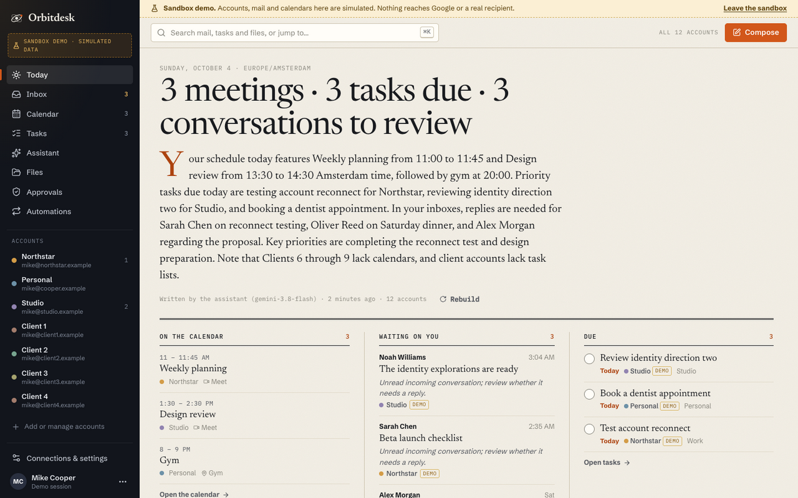

# Orbitdesk

One desk for every Google account. Orbitdesk brings Gmail threads, calendars, tasks and files together, with an assistant that reads the accounts you choose and prepares concrete changes for review.

**[Open the app](https://web-production-cbebe.up.railway.app)** · **[Full product scope](MVP-SCOPE.md)** · **[API contract](docs/API-CONTRACT.md)** · **[Verification record](docs/VERIFICATION.md)**

The public sandbox creates a separate workspace for every visitor, with 12 simulated accounts and 8 calendars. Its assistant uses a real language model. Sandbox email sends and Google mutations are simulated; they never affect real accounts.



## Features

- Account-specific permissions, sending identities, signatures and assistant access.
- Unified inbox, full conversations, replies, reply-all, forwarding, drafts, attachments, archive, labels, stars and trash.
- Immediate or scheduled sends bound to an immutable draft snapshot. A changed draft requires a new decision.
- Calendar agenda/week view, event editing, all-day dates, attendees, Meet links, RSVP and availability across calendars.
- Task lists, tasks, completion, deadlines and source links.
- Drive search, create/copy/rename/trash and summaries. Assistant tools also read Docs, Sheets and Slides and propose document edits.
- A tool-calling assistant with actual tool traces, source references, conversations and approval cards.
- Daily briefs, follow-up suggestions and triage automations. Automated external changes always need review.
- Durable Postgres actions, a pg-boss worker, atomic execution claims, heartbeat and uncertain-outcome handling.
- Isolated sessions, encrypted Google credentials, workspace-scoped resources, validation, HTML sanitization, usage limits and account deletion.

Real Google account connections require a Google web OAuth client. See [Google setup](docs/GOOGLE-SETUP.md). The current hosted sandbox is useful before that client is configured; it clearly marks its simulated accounts. Chat, Forms, Keep, Admin Console and organization-wide delegation are outside this release. Google Meet is supported through Calendar conferences; meeting recordings and transcripts are not included.

## Run locally

Requires Node 24, pnpm 11 and Docker.

```sh
cp .env.example .env
pnpm install
docker compose up -d
pnpm db:generate
pnpm db:migrate
```

Set `SESSION_SECRET` to a random string of at least 32 characters and `TOKEN_ENCRYPTION_KEY` to a base64-encoded 32-byte random key. For example, `openssl rand -base64 32` produces an encryption key. Configure a model provider to enable the assistant.

Start the two processes in separate terminals:

```sh
pnpm dev
pnpm --filter @orbitdesk/worker dev
```

Open http://localhost:3100 and choose the sandbox, or configure Google OAuth and sign in. Development loads the root `.env`; do not commit that file.

## Model providers

The assistant uses the AI SDK. Choose one:

| Provider | Configuration |
| --- | --- |
| Vertex AI | `AI_PROVIDER=vertex`, `GOOGLE_VERTEX_PROJECT`, `GOOGLE_VERTEX_LOCATION=global`, `GOOGLE_VERTEX_CREDENTIALS` containing service-account JSON, and `AI_MODEL=gemini-3.8-flash` |
| Gemini API | `AI_PROVIDER=google`, `GOOGLE_GENERATIVE_AI_API_KEY`, `AI_MODEL=gemini-3.8-flash` |
| Anthropic | `AI_PROVIDER=anthropic`, `ANTHROPIC_API_KEY`, `AI_MODEL=claude-opus-5-5` |

Use a model configuration appropriate for private Workspace content and your provider agreement. The hosted beta uses Vertex AI on a billed project. Its service account has the Vertex AI User role and no Gmail access. User Google credentials are separate OAuth grants.

`MAX_AGENT_RUNS_PER_DAY` defaults to 100 per real workspace. Demo workspaces get 10 runs each, and `DEMO_RUNS_PER_DAY` caps all public demo runs at 100 per UTC day. These counts include failed attempts. Demo data expires after one day.

## Deploy on Railway

Create three services in one project: **Postgres**, **web** and **worker**. Connect web and worker to this repository; both use the root Dockerfile.

Set these on both app services:

```env
DATABASE_URL=${{Postgres.DATABASE_URL}}
APP_URL=https://YOUR-WEB-DOMAIN
NODE_ENV=production
PORT=3100
ENABLE_DEMO=true
BETA_EMAILS=you@example.com
SESSION_SECRET=YOUR_RANDOM_SECRET
TOKEN_ENCRYPTION_KEY=YOUR_BASE64_KEY
```

Add model credentials and Google OAuth configuration using Railway secrets. Set `APP_ROLE=web` on web and `APP_ROLE=worker` on worker. Give web the pre-deploy command `pnpm db:migrate` and healthcheck `/api/health`. Deploy web first, then worker. Keep both services awake for scheduled work. Expose only web; Postgres and worker stay on the private network.

The worker runs TypeScript through `tsx`. The web app uses a production Next.js build. The Dockerfile installs locked dependencies and runs Prisma generation, the frontend build and worker type checking. Persistent state is in Postgres; containers require no persistent volume.

`/api/health` reports database, worker, OAuth configuration and model configuration independently. Missing OAuth does not hide the sandbox. A stale worker is shown as unavailable for schedules and automations.

## Development and verification

```sh
pnpm typecheck
pnpm test
pnpm build
```

Tests require a migrated Postgres database and test/development session and encryption secrets. Integration checks cover tenant isolation, approval races, replay protection, stale drafts, scheduled recovery, calendar dates/DST, encrypted credentials and paginated Gmail history. CI provisions an isolated Postgres service and runs the same checks.

The API layer lives in `packages/core`; `apps/web` renders its shared contract; `apps/worker` runs durable work. External Google calls are made only server-side. The model cannot supply a workspace id, credential, arbitrary HTTP endpoint or approval.

## Open source

MIT licensed. Postiz inspired the connection-adapter, scheduling and review patterns. This is an independent implementation and contains no copied Postiz code. The API contract and frontend were designed with Claude Opus 5.5 using extra-high reasoning; the backend and verification were built with Codex.

The next SaaS milestones are Google verification, billing, invitations/team roles, provider webhooks and broader Workspace integrations. The current application has per-user workspace isolation, but it is not a finished enterprise Workspace suite.
